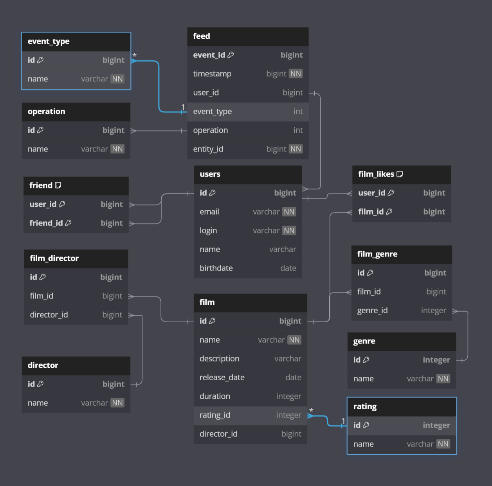

# java-filmorate
Simple REST application, written on Java using Spring Boot.
Allows the user to add, retrieve and delete users and films from database using POST, PUT, GET and DELETE requests.

## Database structure

